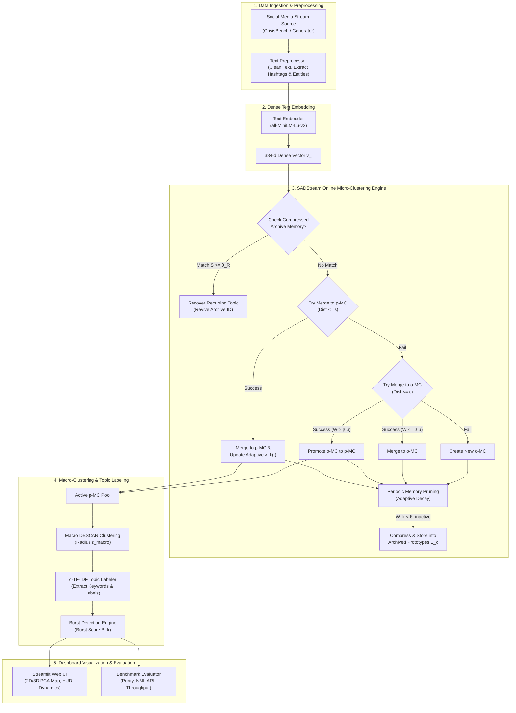

# SADStream System Architecture & Technical Specification

## 1. Overview Architecture

**SADStream** (Adaptive Semantic Stream Clustering & Compressed Memory Engine) is a real-time, online topic detection and tracking system designed for dynamic social media streams (e.g., disaster alerts, breaking news). 

The system architecture consists of 5 core pipeline layers:



---

## 2. Core Components Specification

### 2.1 Layer 1: Data Ingestion & Preprocessing (`src/data/`)
- **`CrisisBenchLoader`**: Streams real human-annotated disaster posts from QCRI/CrisisBench.
- **`SocialStreamGenerator`**: Simulates dynamic social streams with configurable arrival rates, topic bursts, and noise ratios.
- **`TextPreprocessor`**: Sanitizes text, strips URLs/mentions, and extracts lexical features:
  - **Keywords**: Lowercase alphabetic tokens ($\ge 3$ chars).
  - **Entities**: Capitalized word sequences (proper nouns).
  - **Hashtags**: Extracted hashtag tags (`#tag`).

---

### 2.2 Layer 2: Dense Text Embedding (`src/embeddings/`)
- **`TextEmbedder`**: Utilizes pre-trained `sentence-transformers/all-MiniLM-L6-v2` transformer model.
- Maps input text to a 384-dimensional dense semantic vector space $\mathbf{v}_i \in \mathbb{R}^{384}$ normalized to unit length.

---

### 2.3 Layer 3: SADStream Online Engine (`src/engine/`)

#### A. Hybrid Text-Feature Similarity ($S_{hybrid}$)
Instead of pure vector cosine distance, SADStream evaluates a hybrid multi-modal similarity metric combining dense embeddings with lexical metadata:

$$S(x, C_k) = \alpha \cdot S_{sem}(x, C_k) + \beta_{lex} \cdot S_{lex}(x, C_k) + \gamma_{ent} \cdot S_{ent}(x, C_k) + \delta_{hash} \cdot S_{hash}(x, C_k)$$

Where:
- $S_{sem}$: Cosine similarity between embedding $\mathbf{v}_i$ and micro-cluster centroid $\mathbf{c}_k$.
- $S_{lex}, S_{ent}, S_{hash}$: Jaccard similarities on extracted keywords, entities, and hashtags.

#### B. Cluster-Specific Adaptive Decay Rate ($\lambda_k(t)$)
Standard algorithms (e.g., DenStream) apply a global static decay rate $\lambda_0$. SADStream dynamically adjusts decay rate per micro-cluster based on recent activity $A_k(t)$ and burstiness $B_k(t)$:

$$\lambda_k(t) = \frac{\lambda_0}{1 + \eta \cdot B_k(t) + \rho \cdot A_k(t)}$$

- Active or bursty topics have smaller $\lambda_k(t)$, preserving their weights longer.
- Quiet background noise decays rapidly with base rate $\lambda_0$.

#### C. Compressed Long-Term Prototype Memory Archive ($L_k$)
When an inactive micro-cluster weight drops below threshold $W_k < \theta_{inactive}$, it is evicted from active memory into a compressed long-term prototype $L_k$:

$$L_k = \langle \mathbf{c}_k, \text{Keywords}_k, \text{Entities}_k, \text{Hashtags}_k, t_{start}, t_{end} \rangle$$

#### D. Recurring Topic Recovery
When a new post arrives, the engine scans the compressed archive. If similarity $S(x, L_k) \ge \theta_R$, the historical cluster ID is recovered, allowing long-term event tracking across time gaps.

---

### 2.4 Layer 4: Macro-Clustering & Topic Labeling (`src/tracking/`)
- **Macro-DBSCAN (`MacroClusterEngine`)**: Groups active Potential Micro-Clusters ($p$-MCs) using DBSCAN with cosine metric and radius $\varepsilon_{macro}$.
- **c-TF-IDF Topic Labeler (`TopicLabeler`)**: Extracts representative topic titles and top keywords using class-based TF-IDF across micro-clusters.
- **Burst Tracking**: Calculates burstiness score $B_k(t)$ to flag breaking news (`is_bursting`).

---

### 2.5 Layer 5: Web UI & Diagnostic Evaluation (`src/ui/`, `src/evaluation/`)
- **`app.py`**: Streamlit real-time interactive control center.
  - Live HUD Feed of incoming posts with SADStream status tags.
  - 2D/3D PCA Scatter Plot visualizing post vectors, active $p$-MCs, $o$-MCs, and **Archived Prototype Memory**.
  - Stream dynamics line charts ($p$-MC vs $o$-MC trajectory, peak burst score).
  - Hyperparameter Control Center for live tuning.
- **`eval.py`**: Quantitative benchmark evaluator measuring **Purity**, **NMI**, **ARI**, and **Throughput (posts/sec)**.

---

## 3. Algorithm Data Flow Diagram (For draw.io)

Below is the structured data flow suited for draw.io block creation:

```
[Input Stream Post] 
       │
       ▼
[1. Text Preprocessor] ──(Clean Text, Tokens, Hashtags)──► [2. Text Embedder]
                                                                  │ (384d Vector)
                                                                  ▼
┌─────────────────────────────────────────────────────────────────┴────────────────────────────────┐
│ 3. SADStream Engine Processing Loop                                                              │
│                                                                                                  │
│   [Check Archived Memory (L_k)] ──(S >= θ_R)──► [Recover Recurring Topic ID]                     │
│               │ (No Match)                                                                       │
│               ▼                                                                                  │
│   [Calculate Hybrid Similarity S(x, C_k)] ──► [Find Nearest Cluster]                             │
│                                                     │                                            │
│            ┌────────────────────────────────────────┴──────────────────────────┐                 │
│            ▼ (Dist <= ε)                                                       ▼ (Dist > ε)      │
│   [Try Merge to p-MC] ──(Fail)──► [Try Merge to o-MC] ──(Fail)──► [Create New o-MC]             │
│            │ (Success)                     │ (Success)                                           │
│            ▼                               ▼                                                     │
│   [Update Adaptive λ_k(t)]        [Check Promotion: W > β*μ?]                                    │
│                                     ├── (Yes) ──► [Promote to p-MC]                              │
│                                     └── (No)  ──► [Keep as o-MC]                                 │
└──────────────────────────────────────────────────────────────────────────────────────────────────┘
                                      │ (Active p-MCs)
                                      ▼
                      [4. Macro-Clustering (DBSCAN)]
                                      │
                                      ▼
                      [5. c-TF-IDF Topic Labeler]
                                      │
                                      ▼
             [6. Real-Time Streamlit Dashboard & 2D/3D Map]
```

---

## 4. File Structure & Responsibilities

| File Path | Description |
| :--- | :--- |
| `src/data/stream_generator.py` | Social media post stream simulator |
| `src/data/crisisbench_loader.py` | Real disaster dataset loader |
| `src/data/preprocessor.py` | Text cleaning & token extraction |
| `src/embeddings/embedder.py` | SentenceTransformer embedding module |
| `src/engine/sadstream_engine.py` | Proposed SADStream algorithm engine |
| `src/engine/denstream.py` | Baseline DenStream engine |
| `src/engine/micro_cluster.py` | Micro-cluster feature (CF) structure & adaptive decay math |
| `src/tracking/macro_cluster.py` | DBSCAN macro-clustering engine |
| `src/tracking/topic_labeler.py` | c-TF-IDF keyword & label extraction |
| `src/evaluation/evaluator.py` | Benchmark evaluation metrics (Purity, NMI, ARI) |
| `src/ui/components.py` | Streamlit UI cards, 2D/3D PCA map, feed tables |
| `src/ui/styles.py` | Cyberpunk dark glassmorphism styling |
| `app.py` | Main Streamlit Web Demo application |
| `eval.py` | Comparative benchmark evaluation script |
| `main.py` | CLI terminal runner |
